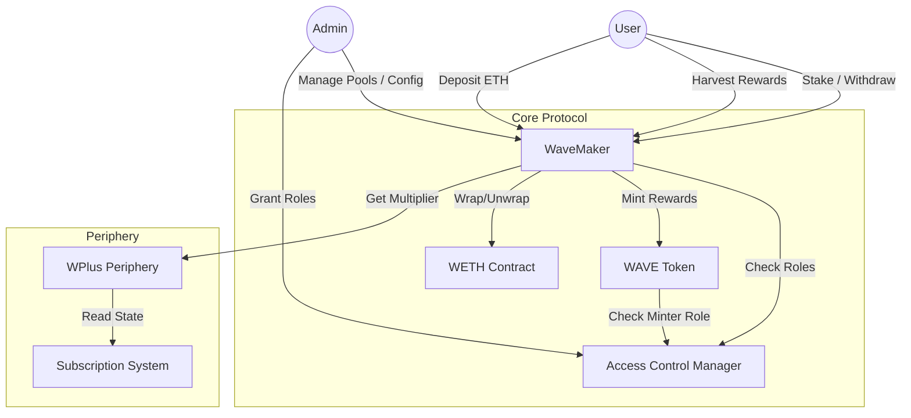
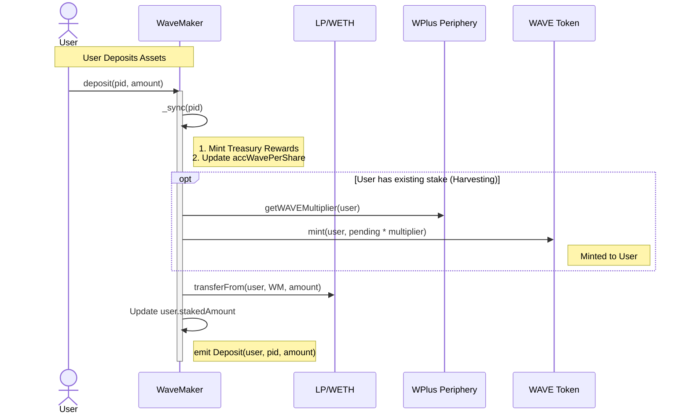
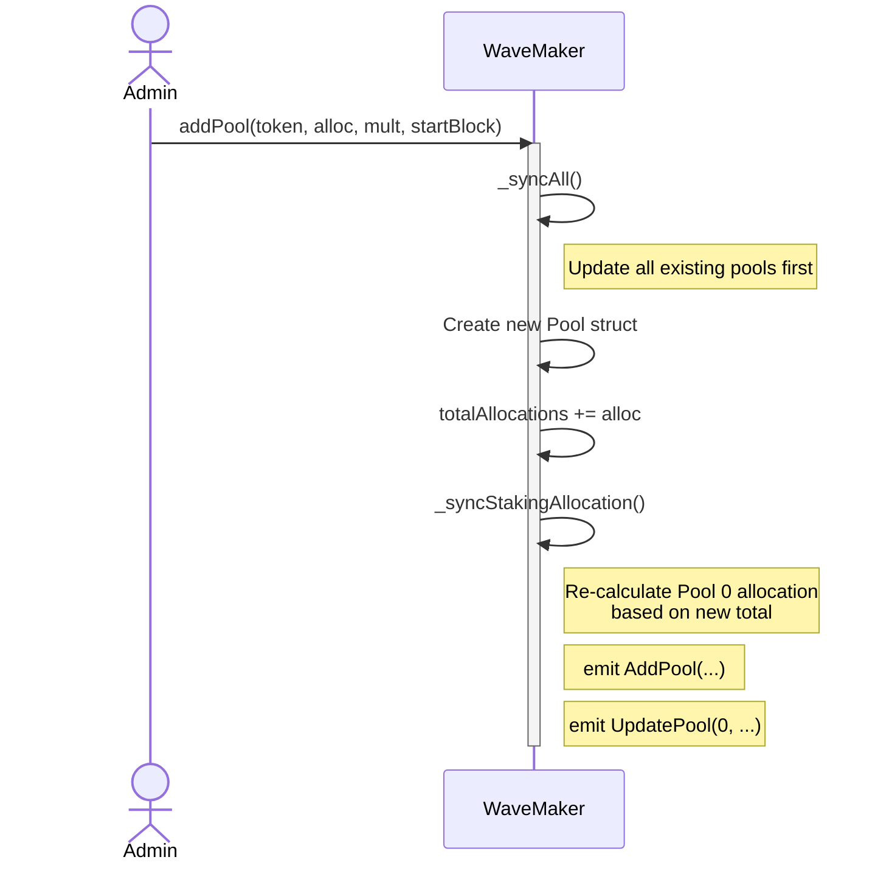

# Wave Protocol Documentation

Comprehensive documentation for the Wave Protocol smart contracts, designed for internal developers and maintainers.

## Overview

The **Wave Protocol** is a yield catalyst on the W Chain Network, designed to incentivize liquidity provision and ecosystem participation. The core mechanism involves users staking assets (LP tokens, single tokens, or ETH) into the `WaveMaker` contract to earn `WAVE` token rewards.

The protocol implements a dynamic reward allocation system where the core staking pool (Pool 0) automatically adjusts its weight relative to all other pools.

## System Architecture

The following diagram illustrates the high-level architecture and interactions between the core contracts.

## Contracts Deep Dive

### 1. WaveMaker (`WaveMakerImpl.sol`)

The `WaveMaker` is the heart of the protocol, functioning similarly to a "MasterChef" contract but with specialized features for the W Chain ecosystem.

#### Key Features & State
- **Pools (`Pool[]`)**: An array of staking pools.
    - **Pool 0**: Special "Staking" pool (typically WAVE/WCO LP). Its allocation is dynamic.
    - **Pool 3 (`ETH_POOL_ID`)**: Reserved for native ETH staking.
- **Rewards**: Distributes `WAVE` tokens based on `wavePerBlock` and pool allocations.
- **Multipliers**: Supports personal reward multipliers via `IPAPeriphery` (e.g., for WPlus subscribers).
- **Treasury**: 10% of minted rewards are sent to a treasury address (logic inside `_sync`).

#### Important Functions
- **`initialize(...)`**: Sets up the contract and creates Pool 0.
- **`initializeETHPool(...)`**: specialized initializer that **MUST** be called when `pools.length == 3` to create the ETH pool at index 3.
- **`deposit` / `withdraw`**: Standard staking actions.
- **`depositETH` / `withdrawETH`**: Handles native ETH by automatically wrapping/unwrapping WETH.
- **`harvestAll`**: Claims pending rewards from all pools where the user has a stake.
- **`sync` / `syncAll`**: Updates pool state (`accWavePerShare`, `lastRewardBlock`) to ensure correct reward calculations.

#### Dynamic Allocation Logic (`_syncStakingAllocation`)
Pool 0 is unique. Its allocation points are not fixed manually but are calculated as a fraction of the sum of all other pools' allocations.
- Formula: `Pool0_Alloc = (Sum_Other_Allocs * stakingAllocationFactor) / BPS`
- Default `stakingAllocationFactor` is 6667 (approx 40% of total weight).

### 2. Access Control Manager (`ACM.sol`)

Centralized access control registry extending OpenZeppelin's `AccessControl`.
- **`DEFAULT_ADMIN_ROLE`**: Super-admin, can grant/revoke other roles.
- **`ADMIN_ROLE`**: Required for `WaveMaker` administrative functions (add pool, set multipliers, etc.).
- **`FACTORY_ROLE`**: Required to mint `WAVE` tokens. The `WaveMaker` contract must be granted this role.

### 3. WAVE Token (`Wave.sol`)

The governance and reward token of the ecosystem.
- **Standard**: ERC20.
- **Minting**: Restricted to addresses with `FACTORY_ROLE` (via `ACM`).
- **Burning**: Inherits `ERC20Burnable`.

### 4. WPlus Periphery (`WPlusPeriphery.sol`)

An adapter contract that interfaces with the external subscription system (`WPLUS`).
- **Function**: `getWAVEMultiplier(account)`
- **Logic**: Returns a multiplier > 1x if the user has an active subscription; otherwise returns 1x.

## Workflows

### User Staking & Harvesting

### Adding a New Pool (Admin)

## Setup & Deployment Guide

1.  **Deploy Dependencies**:
    *   Deploy `ACM`.
    *   Deploy `WAVE` (pass ACM address).
    *   Grant `FACTORY_ROLE` to the future `WaveMaker` address (or do it after deployment).

2.  **Deploy WaveMaker**:
    *   Deploy `WaveMakerImpl` (behind a proxy).
    *   Call `initialize(...)`:
        *   Sets `ACM`, `WAVE`, Treasury.
        *   Initializes Pool 0 (Wave LP).

3.  **Setup ETH Pool**:
    *   Add Pool 1 and Pool 2 using `addPool`.
    *   **Crucial**: Call `initializeETHPool` only when `pools.length` is exactly 3. This sets up the WETH pool at index 3.

4.  **Permissions**:
    *   Ensure `WaveMaker` has `FACTORY_ROLE` in `ACM` to mint rewards.
    *   Ensure Admin has `ADMIN_ROLE` in `ACM` to manage pools.

## Contract Reference

| Contract | Path | Description |
|----------|------|-------------|
| **WaveMaker** | `src/WaveMakerImpl.sol` | Main staking and reward logic. |
| **ACM** | `src/ACM.sol` | Access control management. |
| **WAVE** | `src/Wave.sol` | ERC20 Reward token. |
| **WPlusPeriphery** | `src/WPlusPeriphery.sol` | Multiplier adapter. |
| **Interfaces** | `src/interfaces/` | Solidity interfaces for internal/external calls. |
